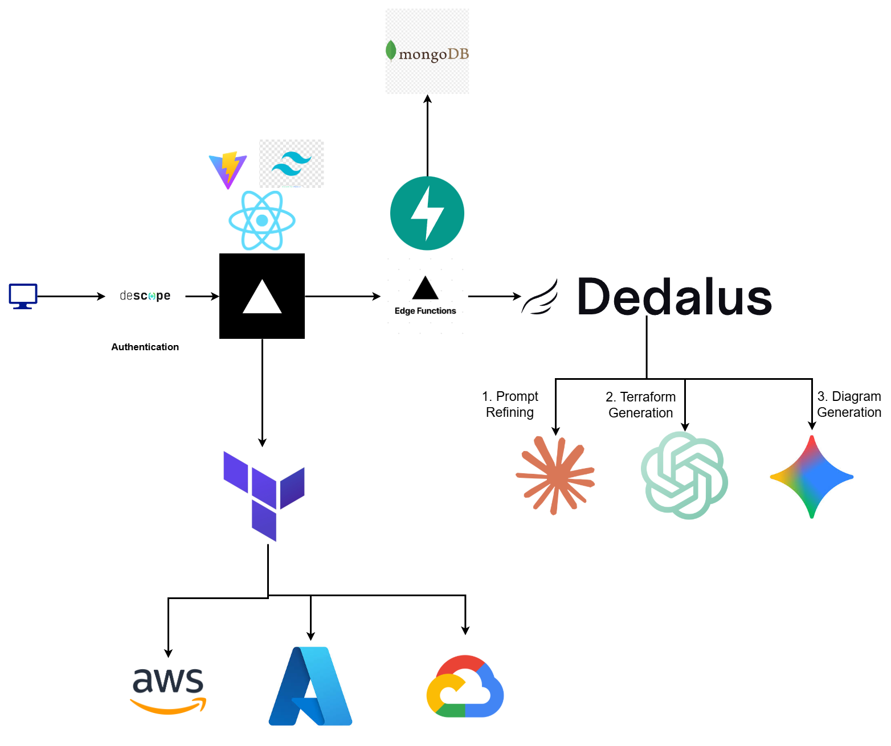

# 🚀 Prompt to Infrastructure



**"Cursor for Infrastructure as Code"**

An AI-powered visual platform that transforms natural language into production-ready cloud infrastructure with interactive diagrams and multi-cloud intelligence.

## 💡 Core Features

-   **natural Language → Infrastructure**: Describe what you need in plain English (e.g., "A REST API with PostgreSQL"), and get production-ready Terraform code.
-   **Visual Diagram Editor**: Interactive React Flow canvas to visualize and edit your architecture with drag-and-drop.
-   **Two-Way Sync**: Edit the diagram OR the code—updates reflect instantly in both.
-   **Multi-Cloud Intelligence**: Switch between AWS, GCP, and Azure with a single click.
-   **Real-Time Cost Estimation**: See estimated monthly costs before you deploy.
-   **Educational Mode**: Learn cloud concepts through interactive building and component explanations.

## 🛠️ Tech Stack

**Frontend**
-   React 19, TypeScript, Vite
-   React Flow (Visual Editor)
-   Monaco Editor (Code Editor)
-   Tailwind CSS (Styling)

**Backend**
-   FastAPI (Python)
-   Multi-Agent AI System (Claude/OpenRouter)
-   Terraform (Infrastructure Generation)

## 🚀 Quick Start

### Prerequisites
-   Node.js (v18+)
-   Python (v3.9+)
-   Descope Project ID (for authentication)
-   LLM API Key (e.g., Anthropic/OpenRouter)

### Installation

1.  **Clone the repository**
    ```bash
    git clone https://github.com/yourusername/prompt-to-infrastructure.git
    cd prompt-to-infrastructure
    ```

2.  **Backend Setup**
    ```bash
    cd backend
    python -m venv venv
    # Windows
    .\venv\Scripts\activate
    # Mac/Linux
    # source venv/bin/activate
    pip install -r requirements.txt
    ```
    Create a `.env` file in `backend/` with your API keys (see `backend/.env.example` if available).

3.  **Frontend Setup**
    ```bash
    cd ../frontend
    npm install
    ```
    Create a `.env` file in `frontend/` with your Descope Project ID:
    ```env
    VITE_DESCOPE_PROJECT_ID=your_project_id
    ```

### Running the App

1.  **Start Backend** (from `backend` dir)
    ```bash
    uvicorn app.main:app --reload
    ```

2.  **Start Frontend** (from `frontend` dir)
    ```bash
    npm run dev
    ```

3.  Open `http://localhost:5173` to start building!
